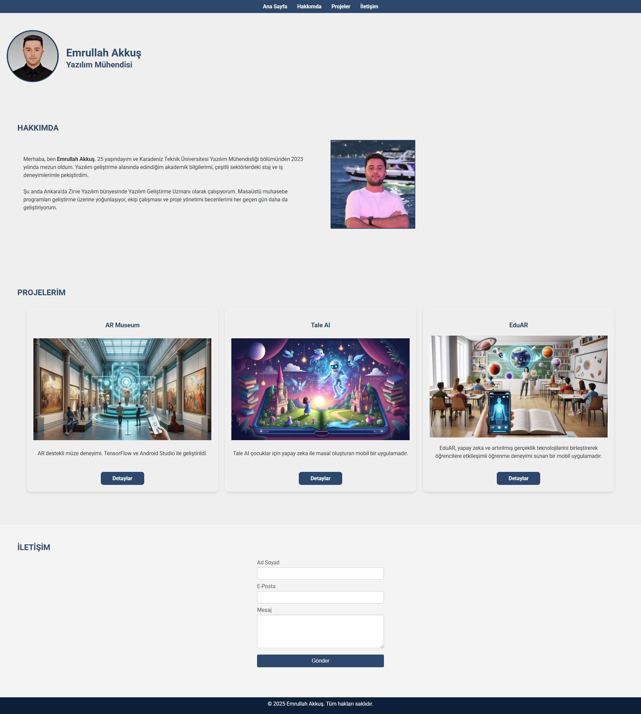

# Portfolio

Bu proje, HTML ve CSS kullanılarak geliştirilmiş basit ve şık bir kişisel portfolyo web sitesidir. Site, ziyaretçilere hakkımda bilgi verir, projelerimi gösterir ve iletişim kurma imkanı sunar.

## 🚀 Kullanılan Teknolojiler

- HTML5  
- CSS3 (Flexbox & Grid)  
- Google Fonts  
- Responsive Tasarım (mobil uyumlu)

## 🎨 Tasarım Yaklaşımı

- Minimal ve kullanıcı dostu arayüz
- Responsive yapı: Mobil, tablet ve masaüstü uyumlu
- Modern renk paleti ve okunabilir fontlar

## 📷 Ekran Görüntüsü

## 🔗 Demo

[Canlı Demo Linki](https://proje-linki.vercel.app)
